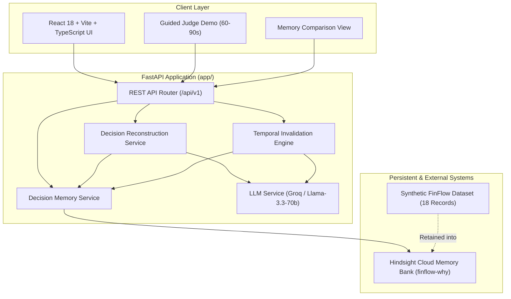

# WHY — Organizational Decision Memory

> **"Remember why. Know when it changes."**

[](https://fastapi.tiangolo.com)
[](https://react.dev)
[](https://www.typescriptlang.org)
[](https://vitejs.dev)
[](https://github.com/hindsight-memory/hindsight)
[](https://groq.com)
[](#20-testing)

---

### At a Glance

| Aspect | Detail |
| :--- | :--- |
| **WHAT** | WHY remembers **why** organizational decisions were made—reconstructing the trade-offs, constraints, and alternatives from historical institutional records. |
| **HOW** | It integrates **Hindsight** as a persistent, compounding organizational memory layer to retain and recall multi-source evidence and prior investigation history. |
| **WHY DIFFERENT** | Unlike static search engines or standard chatbots, WHY performs **temporal reasoning**: it checks whether the original assumptions behind a decision still hold as new organizational evidence surfaces over time. |

> **Notice**: WHY is not a generic conversational assistant, nor does it modify model weights or employ fine-tuning. FinFlow and its organizational records represent a realistic, synthetic demonstration dataset designed to showcase temporal decision intelligence.

---

## Table of Contents

1. [What is WHY?](#1-what-is-why)
2. [The Problem](#2-the-problem)
3. [The Solution](#3-the-solution)
4. [Why This Matters](#4-why-this-matters)
5. [How WHY Works](#5-how-why-works)
6. [Why Hindsight Is Central](#6-why-hindsight-is-central)
7. [How This Is Different From RAG](#7-how-this-is-different-from-rag)
8. [Memory Architecture](#8-memory-architecture)
9. [Decision Reconstruction](#9-decision-reconstruction)
10. [Temporal Decision Change Detection](#10-temporal-decision-change-detection)
11. [Before vs After Hindsight](#11-before-vs-after-hindsight)
12. [FinFlow Demo Scenario](#12-finflow-demo-scenario)
13. [Example Decision Investigation](#13-example-decision-investigation)
14. [System Architecture](#14-system-architecture)
15. [Technology Stack](#15-technology-stack)
16. [Project Structure](#16-project-structure)
17. [Running Locally](#17-running-locally)
18. [Environment Variables](#18-environment-variables)
19. [Demo Flow](#19-demo-flow)
20. [Testing](#20-testing)
21. [Limitations](#21-limitations)
22. [Future Scope](#22-future-scope)
23. [Hackathon Context](#23-hackathon-context)
24. [License & Credits](#24-license--credits)

---

## 1. What is WHY?

**WHY** is an AI agent that remembers why organizational engineering and product decisions were made and detects when the assumptions supporting those decisions may no longer be valid when new evidence is evaluated.

Modern systems are effective at logging *what* occurred—code changes, completed tickets, and incident timelines. However, they lose the context of *why* choices were made: the trade-offs accepted, the migration blockers that forced compromises, and the external dependencies that dictated vendor selections. WHY reconstructs this institutional reasoning and monitors its validity over time.

---

## 2. The Problem

In growing technical organizations, critical architectural choices are made under specific constraints:
- "We picked Vendor X because they had German Girocard certification."
- "We kept the legacy monolith protocol because our primary enterprise client could only send ISO 8583 payloads."
- "We deferred migration Y because of quarterly licensing lead times."

Over 12 to 24 months:
1. **Engineers rotate** and initial context is lost from team memory.
2. **Assumptions quietly expire**: the enterprise client upgrades to REST APIs, or alternative vendors secure required certifications.
3. **Ghost constraints persist**: teams continue paying high vendor premiums or tolerating degraded SLAs out of fear of breaking unremembered dependencies.
4. **Context fragments**: rationales are scattered across Slack threads, Jira tickets, pull requests, and ADRs.

---

## 3. The Solution

WHY introduces **Organizational Decision Memory**:
- **Consolidates Scattered Evidence**: Aggregates disparate operational records into Hindsight long-term memory.
- **Synthesizes Decision Provenance**: Reconstructs the exact context, alternatives considered, constraints, and chosen rationale with strict source citations.
- **Audits Temporal Validity**: Re-evaluates original assumptions against subsequent operational records (subsequent Slack messages, newer tickets, incident postmortems).
- **Surfaces Actionable Review Signals**: Surfaces `REVIEW REQUIRED` status when historical assumptions are found to be invalidated, without overriding human authority.

---

## 4. Why This Matters

- **Eliminates Ghost Constraints**: Prevents teams from operating under architectural restrictions that have already been resolved elsewhere in the organization.
- **Accelerates Vendor & Architecture Reviews**: Provides instant, evidence-backed dossiers detailing why an incumbent was chosen and exactly which assumptions have since shifted.
- **Preserves Institutional Memory**: Safeguards tribal engineering knowledge through team turnover and structural reorganizations.

---

## 5. How WHY Works

WHY executes a structured intelligence workflow:

```
Synthetic Evidence Types (Slack, Jira, PRs, ADRs, Incidents)
                          ↓
              Hindsight Persistent Memory
                          ↓
              Semantic & Entity Recall
                          ↓
            Decision Reconstruction Service
                          ↓
          Persistent Investigation Memory
                          ↓
              Subsequent Signal Recall
                          ↓
          Temporal Comparison & Invalidation
                          ↓
         Decision Assessment (e.g. REVIEW REQUIRED)
```

1. **Ingest Evidence**: Normalized records across Slack, Jira, GitHub PR, ADR, and incident source types from the synthetic FinFlow dataset are retained into Hindsight Cloud (`finflow-why`).
2. **Reconstruct Reasoning**: Extracts the core decision, drivers, constraints, and rejected alternatives with strict citations (`ADR-014`, `PAY-1042`).
3. **Recall Institutional History**: Checks for prior WHY investigations into the same decision to maintain continuity.
4. **Evaluate Temporal Drift**: Cross-references 2024 assumptions against 2025–2026 evidence (e.g., incident reports, client API migrations).
5. **Classify Status**: Labels the decision state (`ACTIVE`, `REVIEW_REQUIRED`, `STALE`, `CONFLICTED`, or `INSUFFICIENT_EVIDENCE`).
6. **Compounding Memory**: Serializes the completed investigation back into Hindsight for future institutional recall.

---

## 6. Why Hindsight Is Central

WHY relies on **Hindsight** as its dedicated persistent memory infrastructure rather than a generic vector database replacement.

- **Persistent Institutional Memory**: Hindsight provides persistent memory that allows WHY to retain and recall organizational evidence across investigations.
- **Compounding Investigation History**: When WHY investigates a decision, it retains that investigation back into Hindsight under a distinct memory type (`decision_investigation`). Future investigations recall this prior AI context alongside primary evidence.
- **Strict Epistemic Hierarchy**:
  $$\text{Primary Organizational Evidence} > \text{Prior AI Reasoning}$$
  Primary documents (ADRs, tickets, commit logs) are authoritative. Prior AI investigations provide continuity but never supersede primary records.

---

## 7. How This Is Different From RAG

Basic/static RAG commonly retrieves relevant documents for the current query. WHY explicitly models the decision baseline, subsequent evidence, persistent investigation history, and decision status.

| Dimension | Basic / Static RAG | WHY + Hindsight Memory |
| :--- | :--- | :--- |
| **Primary Scope** | Retrieves relevant text snippets for an individual query | Models decision reasoning baseline and compares against subsequent evidence |
| **Temporal Focus** | Commonly retrieves documents without differentiating baseline vs. subsequent changes | Explicitly structures chronology: 2024 decision baseline vs. 2025–2026 events |
| **Assumption Drift** | Answers questions based on retrieved content without tracking assumption lifecycles | Evaluates whether historical assumptions were invalidated when new evidence is evaluated |
| **Investigation Continuity** | Queries are typically handled independently | Compounding memory retains completed decision investigations in Hindsight |
| **Decision State** | Produces unstructured explanatory text | Synthesizes evidence to produce explicit decision states (`REVIEW_REQUIRED`, `ACTIVE`, etc.) |

---

## 8. Memory Architecture

WHY organizes institutional memory into two distinct tiers:

1. **Primary Organizational Evidence (`finflow-why`)**:
   - Represents developer and product source types (Slack discussions, Jira tickets, GitHub pull requests, ADRs, and incident postmortems) from the synthetic FinFlow demonstration dataset.
   - Serves as the ground-truth baseline of what was documented in the demonstration scenario.
2. **Decision Investigation Memories (`WHY-INV-...`)**:
   - Stored in Hindsight with structured metadata (`decision_id`, `status`, `affected_reasons`, `invalidated_assumptions`).
   - Retrieved during future inquiries to preserve reasoning history across leadership changes.

---

## 9. Decision Reconstruction

When presented with an architectural inquiry, WHY queries Hindsight and extracts a structured schema:
- **Decision Summary**: Concise statement of what was chosen.
- **Context & Constraints**: The exact environmental limitations at decision time.
- **Key Reasons**: The primary motivations, each tied to specific evidence IDs.
- **Alternatives Considered**: Documented alternatives and why they were declined.
- **Citations & Provenance**: Traceable references directly linking back to source documents.

If Hindsight is bypassed or holds no relevant records, WHY cleanly returns `INSUFFICIENT_EVIDENCE` rather than fabricating rationale.

---

## 10. Temporal Decision Change Detection

The core intelligence layer evaluates temporal changes between baseline rationales and subsequent evidence:

```
[Baseline Rationale (2024)]
  ├── Reason 1: French CB / German Girocard licensing required (ADR-014)
  └── Reason 2: Apex Retail legacy ISO 8583 pipeline dependency (PAY-1042)

[Subsequent Evidence (2025–2026)]
  ├── Incident INC-2025-11: Provider X batch settlement SLA violations
  ├── Slack SLACK-005: Competitor Provider Y gains BaFin Girocard certification
  └── Jira PAY-3310: Apex Retail completes migration to REST API v2

[Temporal Assessment]
  └── Status: REVIEW REQUIRED
      ├── Reason 1 Status: REDUNDANT / CHALLENGED (Alternative certified)
      └── Reason 2 Status: INVALIDATED (Dependency migrated off ISO 8583)
```

> **Important**: WHY does not dictate which vendor to select. It surfaces that the foundational rationale has dissolved and recommends that engineering leadership initiate a formal review.

---

## 11. Before vs After Hindsight

WHY includes a built-in comparative benchmark (`POST /api/v1/demo/memory-comparison`):

| Evaluation Metric | Without Memory (`memory_mode="none"`) | With Hindsight (`memory_mode="hindsight"`) |
| :--- | :--- | :--- |
| **Evidence Recalled** | 0 records | 7+ multi-source organizational records |
| **Decision Reconstruction** | Refusal (`INSUFFICIENT EVIDENCE`) | Grounded (`DECISION RECONSTRUCTED`) |
| **French CB / Girocard Reason** | Undetected | Identified from `ADR-014` |
| **Apex Retail ISO 8583 Reason** | Undetected | Identified from `PAY-1042` |
| **Temporal Change Detection** | Not possible (no baseline) | Detected changed assumptions & SLA breaches |
| **Investigation Compounding**| None (stateless) | Retains & recalls previous WHY investigations |
| **Evidence Grounding** | Refuses when sufficient evidence is unavailable | Reconstructed reasoning is tied to retrieved primary evidence |

---

## 12. FinFlow Demo Scenario

FinFlow is a synthetic European fintech scale-up used as the reference demonstration dataset:

- **May 2024**: Engineering chooses **Provider X** for acquired card payments over Provider Y and Stripe. Key justifications: Provider X's existing French CB/German Girocard licenses (`ADR-014`) and compatibility with enterprise anchor customer Apex Retail's legacy ISO 8583 pipeline (`PAY-1042`).
- **November 2025**: Provider X suffers repeated batch settlement SLA breaches (`INC-2025-11`).
- **January 2026**: Alternative Provider Y obtains full German Girocard licensing (`SLACK-005`).
- **February 2026**: Apex Retail completes modernization to REST API v2, removing the ISO 8583 constraint (`PAY-3310`).

---

## 13. Example Decision Investigation

### User Query
> *"Why did FinFlow choose Provider X for European card payments?"*

### WHY Investigation Result
- **Status**: `⚠ REVIEW REQUIRED`
- **Decision Reconstructed**: FinFlow selected Provider X in May 2024 (`ADR-014`, `PAY-1042`).
- **Historical Assumptions**:
  1. Domestic French Cartes Bancaires and German Girocard licenses are strictly required.
  2. Apex Retail is bound to legacy ISO 8583 settlement messaging.
- **Changed Assumptions Detected**:
  1. *Apex Retail constraint removed*: Migrated to REST v2 (`PAY-3310`).
  2. *Licensing moat eliminated*: Alternative Provider Y secured Girocard certification (`SLACK-005`).
  3. *Operational friction*: Recurring settlement SLA breaches documented in `INC-2025-11`.
- **Review Signal**: The original decision should be re-evaluated because multiple foundational assumptions have changed.

---

## 14. System Architecture



---

## 15. Technology Stack

- **Backend**: Python 3.11+, FastAPI, Pydantic v2, HTTPX, Pytest
- **Memory Engine**: **Hindsight** via the official `hindsight-client` Python SDK
- **LLM Reasoning**: Groq SDK (`llama-3.3-70b-versatile`) with low-temperature deterministic synthesis (mock/offline providers are maintained separately for the test suite)
- **Frontend**: React 18, TypeScript 5.4, Vite 5.2, Tailwind CSS, Lucide React
- **Dataset**: Synthetic FinFlow dataset representing multiple source types (Slack discussions, Jira tickets, GitHub PRs, ADRs, Incidents)

---

## 16. Project Structure

```
why/
├── backend/
│   ├── app/
│   │   ├── api/v1/               # API endpoints (decisions, memory, health, demo)
│   │   ├── core/                 # Config & logging (pydantic-settings)
│   │   ├── memory/               # Hindsight client integration service
│   │   ├── schemas/              # Pydantic v2 domain schemas
│   │   └── services/             # Reconstruction, invalidation, & comparison services
│   ├── tests/                    # Comprehensive Pytest test suite (61 unit/service tests)
│   ├── requirements.txt          # Python dependencies
│   └── .env.example              # Clean backend environment template
├── frontend/
│   ├── src/
│   │   ├── components/           # UI components (GuidedDemo, Comparison, Timeline, Evidence)
│   │   ├── pages/                # HomePage view
│   │   ├── services/api.ts       # Typed API client
│   │   └── types/                # TypeScript interface declarations
│   ├── package.json              # Frontend dependencies
│   └── vite.config.ts            # Vite build configuration
├── data/
│   ├── finflow/                  # 18 synthetic FinFlow records (Slack, Jira, ADRs, PRs, Incidents)
│   └── normalized/               # Canonical normalized JSON events
├── docs/
│   ├── ARCHITECTURE.md           # Deep architectural specification
│   ├── FINAL_DEMO_SCRIPT.md      # 3-minute hackathon presentation script
│   ├── FINAL_JUDGE_QA.md         # Technical Q&A guide
│   ├── DEMO_DATA.md              # Scenario context & evidence provenance
│   ├── SUBMISSION_CONTENT.md     # Official hackathon submission text
│   └── SUBMISSION_CHECKLIST.md   # Pre-submission verification log
├── scripts/
│   ├── build_finflow_dataset.py  # Dataset normalization utility
│   ├── init_hindsight.py         # Memory bank initialization
│   ├── retain_finflow.py         # FinFlow dataset retention script
│   ├── test_hindsight_recall.py  # Live recall verification
│   └── test_memory_comparison.py # Controlled experiment CLI
├── .env.example                  # Root environment template
├── .gitignore                    # Git exclusion rules
└── README.md                     # Master project documentation
```

---

## 17. Running Locally

### 1. Prerequisites
- **Python**: 3.11 or newer
- **Node.js**: 18.0 or newer (with npm)
- **Hindsight**: Access to Hindsight Cloud or a local Hindsight container
- **Groq API Key**: Required for live LLM reasoning (mock services exist separately for automated tests).

### 2. Clone the Repository
```bash
git clone https://github.com/TvrPranay/Project---WHY.git
cd Project---WHY
```

### 3. Backend Setup
```bash
cd backend
python -m venv .venv

# On Windows:
.venv\Scripts\activate
# On macOS/Linux:
# source .venv/bin/activate

pip install -r requirements.txt
```

Create `backend/.env` from `.env.example`:
```bash
cp .env.example .env
```
*(Ensure `backend/.env` is never committed).*

Start the backend API server:
```bash
uvicorn app.main:app --host 127.0.0.1 --port 8001 --reload
```

### 4. Frontend Setup
In a separate terminal:
```bash
cd frontend
npm install
npm run dev
```
Open **`http://localhost:5173`** in your browser.

---

## 18. Environment Variables

Configure the following variables in `backend/.env`:

```env
# Application Settings
ENVIRONMENT=development
DEBUG=True
PROJECT_NAME="WHY"
PORT=8001
CORS_ORIGINS=["http://localhost:5173", "http://127.0.0.1:5173"]

# Hindsight Persistent Memory Configuration
HINDSIGHT_API_KEY=your_hindsight_api_key_here
HINDSIGHT_BASE_URL=https://api.hindsight.vectorize.io
HINDSIGHT_BANK_ID=finflow-why

# LLM Reasoning Provider Configuration
LLM_PROVIDER=groq
GROQ_API_KEY=your_groq_api_key_here
LLM_MODEL=llama-3.3-70b-versatile
LLM_TEMPERATURE=0.1
LLM_MAX_TOKENS=4096
```

> **Security Note**: Never commit your actual `.env` file. Both `.env` and `backend/.env` are ignored by `.gitignore`.

---

## 19. Demo Flow

Experience the system using the interactive **Guided Demo** in the web interface:

1. **Step 1: Ask**: Input an architectural decision query (e.g., *"Why did FinFlow choose Provider X for European card payments?"*).
2. **Step 2: Without Memory**: Observe that without Hindsight, an isolated LLM honestly refuses with `INSUFFICIENT EVIDENCE`.
3. **Step 3: With Hindsight**: Reconstruct the decision using persistent organizational memory, displaying primary citations (`ADR-014`, `PAY-1042`).
4. **Step 4: What Changed**: Run temporal invalidation to inspect subsequent signals (`INC-2025-11`, `PAY-3310`, `SLACK-005`) that triggered `REVIEW REQUIRED`.
5. **Step 5: Compounding Memory**: Retain the completed investigation into Hindsight Cloud (`WHY-INV-...`) for future recall.

---

## 20. Testing

### Run Backend Unit & Service Tests
```bash
cd backend
.venv\Scripts\python -m pytest tests/
```
```
================== 61 passed, 3 skipped, 1 warning in 2.19s ===================
```

### Run Frontend Production Build
```bash
cd frontend
npm run build
```
```
✓ built in 7.11s (0 errors)
```

---

## Demo Screenshots & Visuals

*Demo screenshots will be added before final submission.*

---

## 21. Limitations

- **Synthetic Reference Data**: Evaluated using 18 curated synthetic records reflecting the FinFlow fintech organization.
- **Scope of Demonstration**: Primary focus is currently on payment infrastructure and vendor selection decisions.
- **Synthesis Dependency**: While grounded in citations, narrative synthesis quality depends on underlying LLM adherence to provided evidence.
- **Network Requirement**: Cloud memory synchronization requires network access to Hindsight Cloud.

---

## 22. Future Scope

- **Real-Time Workspace Connectors**: Direct webhooks for live Slack channels, Jira projects, and GitHub repositories.
- **Automated Invalidation Alerts**: Proactive notifications dispatched to engineering leads when new tickets or PRs challenge active architectural decisions.
- **Multi-Bank Federation**: Separate Hindsight banks mapped across distinct engineering domains (Security, Infrastructure, Data Platform).
- **Interactive Assumption Graph**: Graph-based visualization of inter-dependent organizational decisions and shared assumptions.

---

## 23. Hackathon Context

WHY was built for the **Hindsight Hackathon**, demonstrating how persistent, long-term organizational memory unlocks new classes of temporal reasoning agents that cannot be realized with stateless LLMs or basic RAG chunk retrieval.

---

## 24. License & Credits

- Built with [Hindsight](https://github.com/hindsight-memory/hindsight) by Vectorize.
- Powered by [Groq](https://groq.com) for high-speed inference.
- Distributed under the MIT License.
