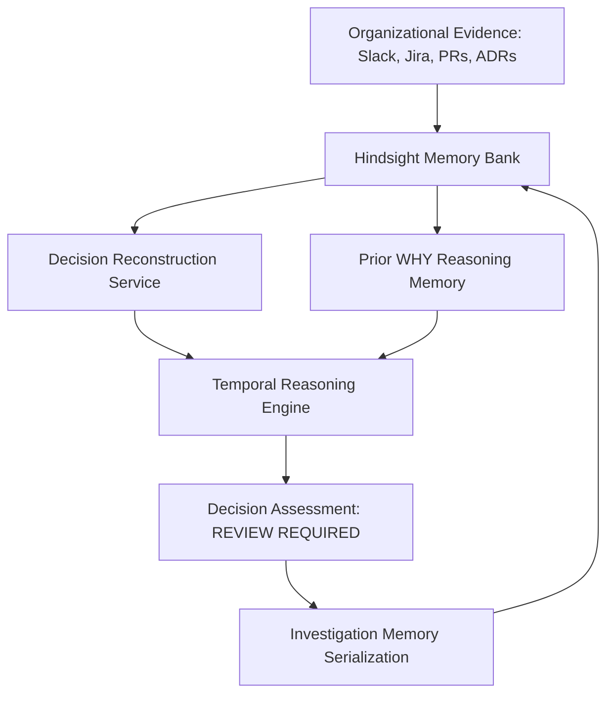

# WHY — System Architecture & Technical Design

> **"An AI agent that remembers why organizational decisions were made and detects when the assumptions behind them change."**

---

## 1. System Overview

Modern engineering organizations make hundreds of consequential architectural and product decisions across disparate channels—Slack discussions, Jira tickets, pull requests, meeting notes, and incident post-mortems. Over time, original justifications fade from institutional memory as teams rotate. Organizations are left maintaining obsolete, high-friction systems out of fear of breaking unknown dependencies.

**WHY** solves this by establishing **Hindsight** as a persistent, temporal organizational memory bank coupled with LLM reasoning. WHY reconstructs historical decision rationale with citations and detects when subsequent organizational events invalidate original foundational assumptions.



---

## 2. Component Architecture

The WHY platform is organized into three decoupled layers:

### A. Memory Layer (Hindsight Cloud)
- **Engine**: Official `hindsight-client` Python SDK connecting to Hindsight Cloud (`api.hindsight.vectorize.io`).
- **Memory Bank**: `finflow-why` (an isolated memory bank namespace for the FinFlow organization).
- **Functionality**:
  - Semantic and entity-aware retrieval over organizational history.
  - Multi-source evidence consolidation across time (2024 to 2026).
  - Persistent storage of both primary organizational evidence and completed AI investigation memories.

### B. Backend Intelligence Services (FastAPI + Groq)
- **`DecisionReconstructionService`**: Reconstructs why a decision was made by querying Hindsight, extracting constraints, evaluated alternatives, and cited documents (`ADR-014`, `PAY-1042`). Supports `memory_mode="none"` (controlled bypass) and `memory_mode="hindsight"`.
- **`DecisionInvalidationService`**: Performs temporal reasoning by comparing original assumptions against later organizational signals to detect whether constraints have changed, generating statuses like `REVIEW REQUIRED`.
- **`DecisionMemoryService`**: Formats completed decision investigations into structured semantic narratives, retains them back into Hindsight (`WHY-INV-...`), and recalls prior AI reasoning for compounding institutional knowledge.
- **`MemoryComparisonService`**: Executes controlled before/after experiments demonstrating the contrast between ungrounded LLMs and Hindsight-backed memory.
- **`LLMService`**: Provider-agnostic abstraction utilizing Groq (`llama-3.3-70b-versatile`) with deterministic low-temperature generation.

### C. Presentation Layer (React + TypeScript + Vite)
- **Normal Investigation Mode**: Interactive search, decision overview, interactive 2024–2026 timeline, invalidation assessment banners, reason comparisons, and evidence drawer.
- **Controlled Comparison View** (`MemoryComparison.tsx`): Side-by-side card contrast comparing Mode A (Without Memory &rarr; `INSUFFICIENT EVIDENCE`) against Mode B (With Hindsight &rarr; `DECISION RECONSTRUCTED`).
- **Judge-Ready Guided Demo** (`GuidedDemo.tsx`): 5-step numbered walkthrough (`01 Ask`, `02 Without Memory`, `03 With Hindsight`, `04 What Changed`, `05 Remember`) taking evaluators through the complete product story in 60–90 seconds.

---

## 3. Data Flow & Execution Pipeline

```
[User Question]
       │
       ▼
[Decision Reconstruction Service]
       │
       ├─► memory_mode == "none" ──────► [Bypass Recall] ──────► [INSUFFICIENT EVIDENCE]
       │
       └─► memory_mode == "hindsight"
                 │
                 ├─► Hindsight Recall (Bank: finflow-why)
                 │         ├─► Primary Organizational Evidence (Slack, Jira, ADRs)
                 │         └─► Prior WHY Investigation Memories
                 │
                 ▼
         [Reconstructed Decision + Citations (ADR-014, PAY-1042)]
                 │
                 ▼
       [Temporal Invalidation Engine]
                 │
                 ├─► Recall Later Events (2025 SLA Breaches, 2026 Alternatives)
                 ├─► Compare Historical Assumptions vs Current Reality
                 │
                 ▼
         [Assessment: REVIEW REQUIRED]
                 │
                 ▼
       [Decision Memory Loop]
                 │
                 └─► Retain Investigation in Hindsight (WHY-INV-...)
```

---

## 4. Role of Hindsight vs Traditional Vector Databases / RAG

WHY does **not** treat Hindsight as a generic vector database or static RAG chunk store:

1. **Decisions Are Temporal Chains**: Decisions are not isolated text chunks; they are evolving networks of human consensus, trade-offs, and constraints across time.
2. **Mental Models**: Hindsight retains entities, relationships, and temporal contexts, allowing WHY to query what was believed in April 2024 and contrast it with what was discovered in January 2026.
3. **Persistent Compounding**: Completed investigations are stored back into Hindsight as prior reasoning, allowing future investigations to leverage earlier institutional analysis.

---

## 5. Epistemic Hierarchy: Primary Evidence vs Prior AI Reasoning

To maintain scientific integrity and prevent self-reinforcing hallucinations, WHY enforces a strict epistemic hierarchy across all intelligence services:

```
┌─────────────────────────────────────────────────────────────┐
│ 1. AUTHORITATIVE BEDROCK: Primary Organizational Evidence   │
│    (ADRs, Jira Tickets, PR Reviews, Incident Post-Mortems) │
├─────────────────────────────────────────────────────────────┤
│ 2. CONTEXTUAL REASONING: Prior WHY AI Investigation Memory  │
│    (Derived AI analyses, historical review summaries)       │
└─────────────────────────────────────────────────────────────┘
```

- **Rule 1: Primary Evidence Always Wins**: If current primary organizational records contradict prior AI reasoning, the primary evidence is authoritative.
- **Rule 2: Citation Isolation**: Only authoritative primary document IDs (e.g. `ADR-014`, `PAY-1042`, `SLACK-005`) may be cited as evidence in reconstructed rationales. Prior AI memories are never cited as primary source documents.
- **Rule 3: Transparent Demarcation**: All user interfaces and LLM prompts clearly label prior investigations as `Prior AI reasoning (context only)`.

---

## 6. Decision Reconstruction & Temporal Invalidation Engine

### Decision Reconstruction
When given a query such as *"Why did FinFlow choose Provider X for European card payments?"*:
1. Semantic recall retrieves records from the decision adoption timeframe (April 2024).
2. The LLM extracts:
   - The core decision adopted.
   - Distinct rationales with verifiable source IDs (`ADR-014`, `PAY-1042`).
   - Alternatives considered and rejected (`Provider Y`, `Provider Z`).
   - Downstream client constraints (Apex Retail ISO 8583 protocol requirement).

### Temporal Invalidation Reasoning
To answer *"Does that reasoning still hold?"*:
1. The engine extracts the foundational assumptions:
   - *Assumption 1*: Provider Y lacks French CB and German Girocard scheme certifications.
   - *Assumption 2*: Apex Retail requires legacy ISO 8583 batch settlement protocol.
2. The engine queries Hindsight for subsequent events (2025–2026):
   - *Signal 1*: Provider Y obtained BaFin Girocard certification (`SLACK-005`).
   - *Signal 2*: Apex Retail completed its REST API v2 migration (`PAY-3310`).
   - *Signal 3*: Architectural review recommended deprecating Provider X (`ADR-028`).
3. The engine evaluates each assumption and assigns:
   - `INVALIDATED` (High Impact)
   - Overall decision status: `REVIEW REQUIRED`

---

## 7. Decision Memory Evolution & Compounding Loop

1. **Retention**: Completed assessments are serialized into structured semantic summaries with metadata (`memory_type="decision_investigation"`, `decision_id="finflow-provider-x-europe"`, `status="REVIEW_REQUIRED"`).
2. **Persistence**: The record is stored in Hindsight Cloud with a deterministic ID (`WHY-INV-...`).
3. **Recall**: When the same or related decision is investigated in the future, WHY recalls this investigation, recognizing that the decision was previously analyzed and marked for review.

---

## 8. Controlled Before/After Memory Experiment

To prove Hindsight is essential, WHY provides a controlled before/after experiment executing against the same question:

| Dimension | Mode A: Without Memory (`none`) | Mode B: With Hindsight (`hindsight`) |
| :--- | :--- | :--- |
| **Recall Pipeline** | Bypassed (`recalled_evidence = []`) | Active against bank `finflow-why` |
| **Evidence Recalled** | 0 records | 7+ authoritative records |
| **Prior Investigations** | 0 memories | 1+ compounding memories |
| **Reconstruction Status** | `INSUFFICIENT EVIDENCE` | `DECISION RECONSTRUCTED` |
| **Key Rationales Found** | Unknown | French CB / Girocard licensing + Apex ISO 8583 |
| **Citations** | 0 | `ADR-014`, `PAY-1042` |
| **Integrity Principle** | Honest refusal (zero hallucinations) | Grounded in authoritative evidence |

---

## 9. Security & Production Hardening

- **Zero Tracked Secrets**: Credentials (`HINDSIGHT_API_KEY`, `GROQ_API_KEY`) are managed via environment variables and strictly ignored by Git.
- **Fail-Safe Degradation**: If Groq is unavailable, an offline deterministic fallback generator provides predictable test and demonstration execution.
- **Non-Blocking Health Check**: `GET /api/health` probes Hindsight reachability with isolated timeout protection, preventing server hang if external networks degrade.
