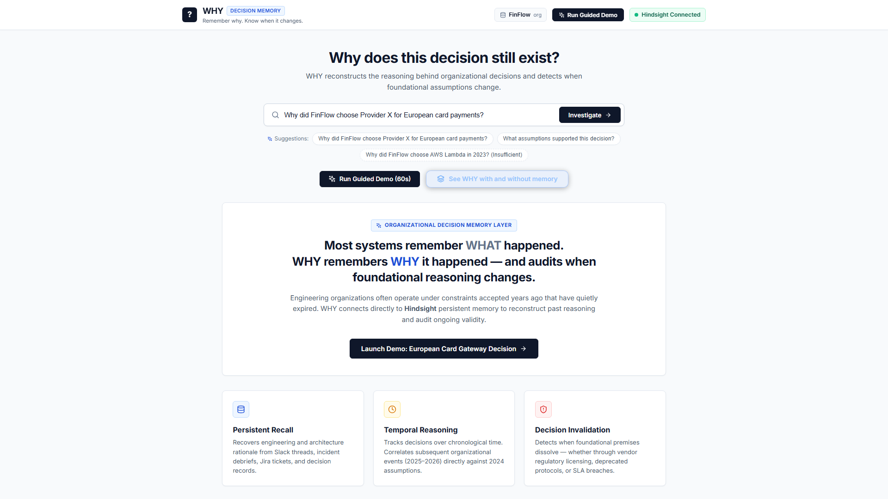
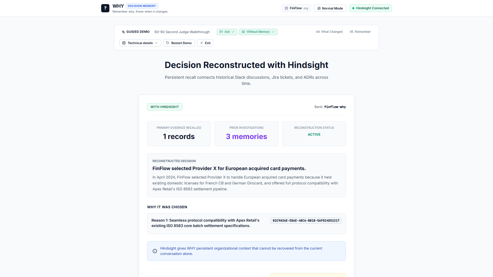
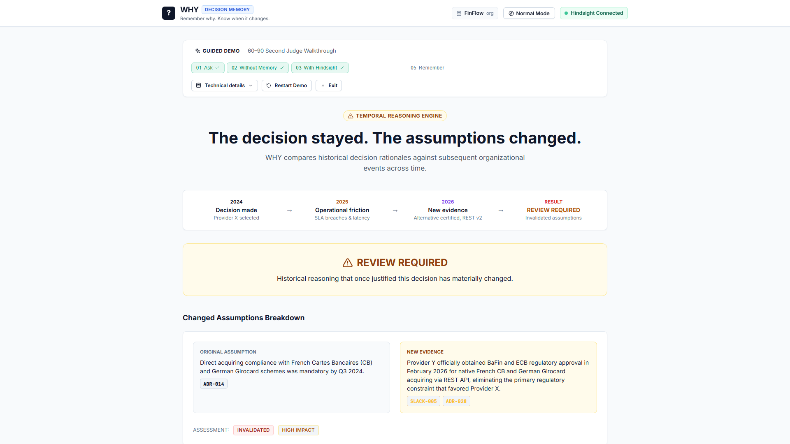
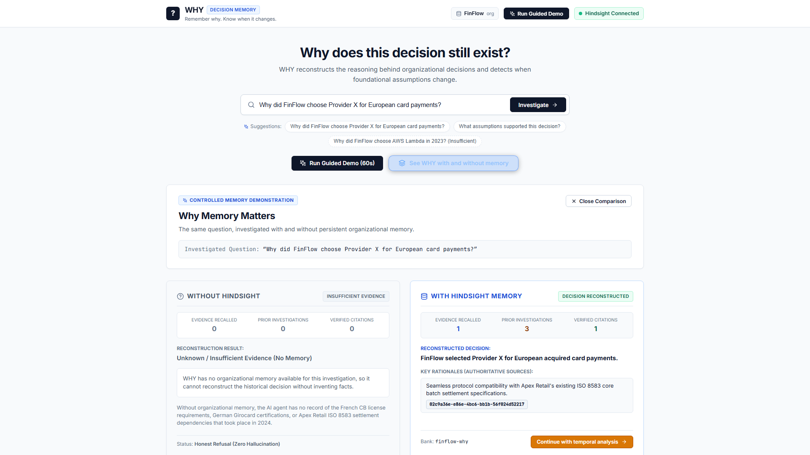

# Why Old Decisions Outlive Their Reasons with Hindsight

There's a specific kind of organizational debt that doesn't show up in any backlog. It's the architectural decision nobody on the current team made, that was reasonable when someone did make it, and that has been quietly wrong for eighteen months. The vendor is underperforming. The blocker that prevented switching no longer exists. But nobody touched it, because nobody could explain with confidence why it was chosen in the first place.

Building [WHY](https://github.com/TvrPranay/Project---WHY) kept pulling me back to this pattern: you ask "Why do we still use X?" and the answer is some version of "I think there was a reason — probably in a Slack thread from 2023." That thread is gone, or buried under tens of thousands of others, or only in the head of someone who left the team.

WHY is an agent that reconstructs the original reasoning behind organizational decisions and checks whether those reasons still hold when evaluated against later evidence — using [Hindsight](https://github.com/vectorize-io/hindsight) as the persistent memory layer that makes this possible across time.

---

## The Problem: Ghost Constraints

Decisions get made under specific conditions:

- "We picked Provider X because they had German Girocard acquiring certification and Provider Y did not."
- "We kept the ISO 8583 pipeline because our anchor enterprise customer, Apex Retail, could only send batch settlements in that format."

These are real constraints — the right reasons at the time. The problem is what happens over the next 12 to 24 months. Engineers rotate. Slack threads get buried. The constraints quietly expire: Provider Y gets certified, Apex Retail migrates to a REST API. But the decision remains, carrying what I call a **ghost constraint** — an assumption that was once real, that has since been resolved elsewhere in the organization, but that nobody noticed or documented as resolved.

Teams continue operating under these ghost constraints — paying vendor premiums, tolerating degraded SLAs — not because the constraints are real, but because nobody can verify whether they still are. The decision persists in code and infrastructure. The reasoning dissipates the moment the people who understood it move on.

---

## What I Built

WHY is a FastAPI and React application that reconstructs organizational decision reasoning from distributed historical records — Slack discussions, Jira tickets, pull request descriptions, ADRs, and incident post-mortems — and evaluates whether the original assumptions have been invalidated by subsequent events.

The key distinction is between **what happened** (which tools like Jira and GitHub track reasonably well) and **why a decision was made** (which is scattered, fragmented, and ephemeral). WHY does not make business decisions. It surfaces `REVIEW REQUIRED` when foundational assumptions have materially changed and leaves the judgment call with the engineers.

For demonstration, I built a synthetic dataset representing a fictional European fintech called FinFlow: a vendor selection in May 2024 justified by specific regulatory and technical constraints, followed by organizational events in 2025 and 2026 that invalidated those constraints.



---

## Why This Workflow Needed More Than Retrieval

WHY is designed specifically around four things that are difficult to assemble with a single stateless document query:

**A historical baseline.** The reconstruction must separate what was decided in May 2024 from what happened in November 2025. These are different temporal layers in the same memory bank.

**Subsequent evidence queried separately.** After establishing the baseline, the invalidation engine queries Hindsight again for later signals — a structurally different query against the same bank.

**Investigation continuity.** If the same question runs a week later, WHY recalls that it already investigated this decision. Prior investigation context informs the new run without replacing primary organizational evidence.

**Explicit decision state.** The output is a structured assessment — `ACTIVE`, `REVIEW REQUIRED`, `STALE`, `INSUFFICIENT EVIDENCE` — not a narrative paragraph.

These requirements are what led me to structure WHY around [Hindsight](https://hindsight.vectorize.io/) as a dedicated persistent memory layer.

---

## How Hindsight Is Used

[Hindsight](https://github.com/vectorize-io/hindsight) is central to every step. Organizational records are retained into an isolated bank (`finflow-why`) using the official Python SDK:

```python
# Retain an organizational record into the finflow-why memory bank
response = client.retain(
    bank_id=target_bank,
    content=content,           # Evidence text: Slack message, ADR excerpt, etc.
    context=context,           # Short descriptor for semantic indexing
    document_id=document_id,   # e.g. "ADR-014", "PAY-1042"
    timestamp=timestamp,
    metadata=safe_metadata,
    tags=tags,
)
```

Investigation queries call `client.recall()` against the same bank. The more consequential design decisions are in what gets retained and how the results are used.

### Two Memory Tiers

WHY maintains two distinct tiers in the same bank:

**Tier 1: Primary Organizational Evidence.** The synthetic FinFlow records — ADRs, Jira tickets, Slack threads, incident reports — ingested at setup. These are authoritative.

**Tier 2: Decision Investigation Memories.** When WHY completes an investigation, it serializes the full result — the reconstructed decision, cited reasons, changed assumptions, and assessment status — into a structured natural language document and retains it back into Hindsight:

```python
# Retain a completed investigation for future recall
doc_id = f"WHY-INV-{int(now_dt.timestamp())}-{decision_id[:24]}"

retained_id = await self.memory_service.aretain_memory(
    content=content,            # Serialized investigation narrative
    context=f"Decision Investigation: {request.decision[:80]}",
    document_id=doc_id,
    timestamp=now_dt,
    metadata={
        "source_type": "decision_investigation",
        "memory_type": "decision_investigation",
        "decision_id": decision_id,
        "status": status_val,   # e.g. "REVIEW REQUIRED"
    },
    tags=["why_investigation", "decision_investigation"],
    bank_id=target_bank,
)
```

On the next investigation of the same question, WHY recalls prior investigation memories alongside primary evidence — but keeps them strictly separated. If a previous investigation reached an incorrect conclusion and that conclusion gets promoted to the same authority level as an ADR, the error compounds. The reconstruction service explicitly filters before constructing the LLM prompt:

```python
# Separate primary organizational evidence from prior AI investigation memories
primary_memories = [
    m for m in memories
    if (m.source_type or "").lower() != "decision_investigation"
    and "[why decision investigation memory]" not in (m.content or "").lower()
]
evidence_to_use = primary_memories if primary_memories else memories
```

The LLM receives two clearly labeled sections — primary evidence (authoritative) and prior investigation context (non-authoritative) — and the system prompt forbids citing prior investigation IDs as source evidence.



---

## Temporal Assumption Drift: The FinFlow Example

When WHY investigates "Why did FinFlow choose Provider X for European card payments?", it reconstructs two gating assumptions from the 2024 evidence:

1. Provider X holds French Cartes Bancaires and German Girocard acquiring certifications that Provider Y does not. *(Cited: `ADR-014`)*
2. Apex Retail requires ISO 8583 batch settlement format that only Provider X supports. *(Cited: `PAY-1042`)*

The invalidation engine then runs a separate, differently-framed Hindsight query targeting later developments. A query framed around "why was the decision made" surfaces 2024-era evidence; the 2025 incident reports and 2026 certification updates score lower for that framing, so a separate query is necessary:

- `INC-2025-11`: Provider X suffered recurring batch settlement SLA violations.
- `SLACK-005`: Provider Y obtained German Girocard certification.
- `PAY-3310`: Apex Retail completed migration to REST API v2, removing the ISO 8583 dependency entirely.

The assessment for each original assumption:

```
Reason 1 (Certification moat): WEAKENED — Alternative provider now certified (SLACK-005)
Reason 2 (ISO 8583 dependency): INVALIDATED — Enterprise client migrated off legacy protocol (PAY-3310)
Overall Status: REVIEW REQUIRED
```

The result is not "switch to Provider Y" — it is that both gating constraints have been resolved, warranting a formal review by the engineers with full organizational context.



---

## The Before/After Demonstration

Running the same question with memory bypassed (`memory_mode="none"`) versus Hindsight enabled makes the role of persistent memory explicit:

| | Without Hindsight | With Hindsight |
|---|---|---|
| Evidence recalled | 0 records | Organizational records from bank |
| Decision reconstruction | Refused | Completed with citations |
| Primary citations identified | None | `ADR-014`, `PAY-1042` |
| Temporal invalidation | Not possible | `SLACK-005`, `PAY-3310`, `INC-2025-11` detected |
| Final status | `INSUFFICIENT EVIDENCE` | `REVIEW REQUIRED` |

The difference is not the language model — the same model runs in both cases. Without Hindsight, the agent refuses rather than fabricating a plausible-sounding rationale. With Hindsight, it has the evidence base to reconstruct reliably and assess temporal drift.



---

## Lessons Learned

**Serialize investigation memories as natural language, not JSON.** My first instinct was to store completed investigations as structured JSON blobs. Hindsight's memory layer is optimized for semantic recall. A human-readable structured narrative worked better for the semantic recall behavior I was targeting than a JSON dump.

**Epistemic separation requires active enforcement.** The two-tier design sounds clean in theory, but Hindsight's recall response does not automatically distinguish between a primary organizational record and a prior investigation memory WHY itself retained. Filtering on `source_type` metadata before constructing the LLM prompt is what enforces the hierarchy.

**The zero-recommendation rule in the prompt is load-bearing.** Without an explicit constraint that WHY must not recommend a new vendor, the LLM tends to complete the reasoning chain and suggest switching. The prompt rule that produces `REVIEW REQUIRED` output rather than a vendor recommendation keeps the system advisory rather than prescriptive.

**The synthetic dataset is a real limitation.** The FinFlow scenario demonstrates the pattern on 18 curated records. A production deployment would need live ingestion connectors — Slack webhooks, Jira sync, GitHub PR processing — that do not exist in the current implementation. The narrative synthesis quality also depends on the underlying LLM adhering to the provided evidence. Both of these are gaps between demonstration and production.

---

## Closing

Organizations are quite good at recording what happened. Code changes, ticket resolutions, incident timelines — these are well-documented. What gets lost is the deliberative layer: the reasoning, the trade-offs, the constraints that were real at the time, the alternatives that were rejected and why.

A decision can remain in an organization long after the reason for making it has disappeared. [Hindsight](https://hindsight.vectorize.io/) provides the persistent retain and recall layer that makes it possible to preserve that reasoning and check whether the assumptions behind it have changed — so teams can make a deliberate choice rather than unknowingly operating under constraints that no longer exist. Old decisions outlive their reasons all the time. The question is whether you find out before or after it becomes a problem.

---

*[WHY is open source.](https://github.com/TvrPranay/Project---WHY) Built with FastAPI, React, Hindsight Cloud, and Groq. The Hindsight memory SDK is at [github.com/vectorize-io/hindsight](https://github.com/vectorize-io/hindsight). More on agent memory at [vectorize.io/what-is-agent-memory](https://vectorize.io/what-is-agent-memory).*
